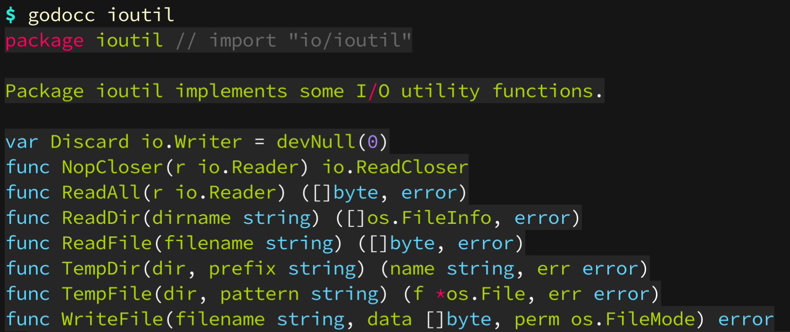
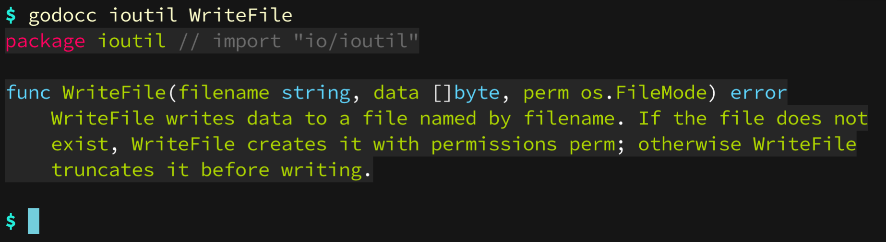

# godocc

Like `go doc` but with colors.

## Installation

```
$ go get -u github.com/inancgumus/godocc
```

## Usage

Accepts all the arguments and flags `go doc` works with. Godocc is just a simple wrapper around the go doc tool.

Example:

```
$ godocc ioutil WriteFile
```



## Styling

godocc comes with many colors! Configure the color of the output by setting the following env variable:

```
$ GODOCC_STYLE="dracula"
```

**Available styles are:** abap, algol, arduino, autumn, borland, bw, colorful, dracula, emacs, friendly, fruity, github, igor, lovelace, manni, monokai, monokailight, murphy, native, paraiso-dark, paraiso-light, pastie, perldoc, pygments, rainbow_dash, rrt, solarized-dark, solarized-light256, solarized-light, swapoff, tango, trac, vim, vs, xcode.

_NOTE: Godocc uses the awesome [Chroma](https://github.com/alecthomas/chroma) package underneath._
